# Assignment 1

**Name:** Avirup Roy

**Group:** IT-2513

**Course:** Web Technologies 1

**Live Site:** [https://aviruproyneal.github.io/assignment1_webtech/]

---

## Introduction to HTML:

### Step 0: Boilerplate

I set up the base HTML file with `<!DOCTYPE html>`, `<html>`, `<head>`, `<title>`, and `<body>`. My page title is "Avirup Roy | My First Webpage".

**Screenshot:**

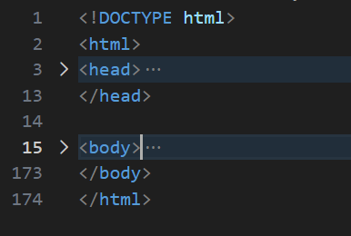

### Step 1: Headings and Paragraph

Here, I used `<h1>` for my name, `<h2>` for the greeting, and `<h3>` for the course name. Then, I added an "About Me" paragraph with a short intro.

**Screenshot:**
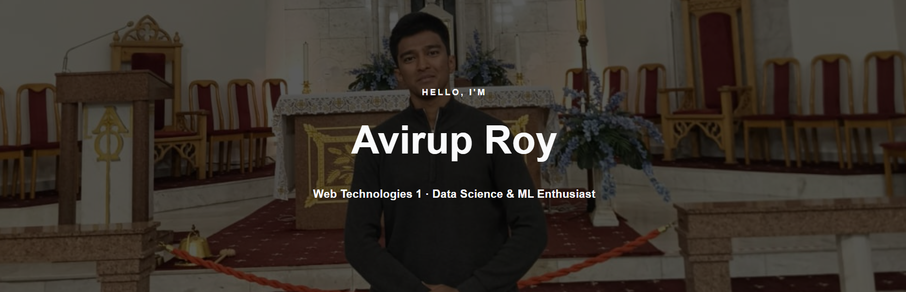
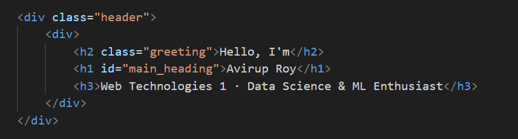
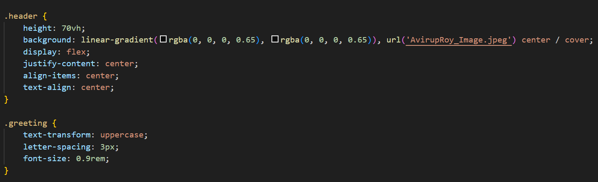
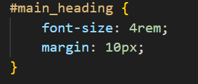

### Step 2: Lists

I created an ordered list for hobbies and an unordered list for favourite websites.

**Screenshot:**
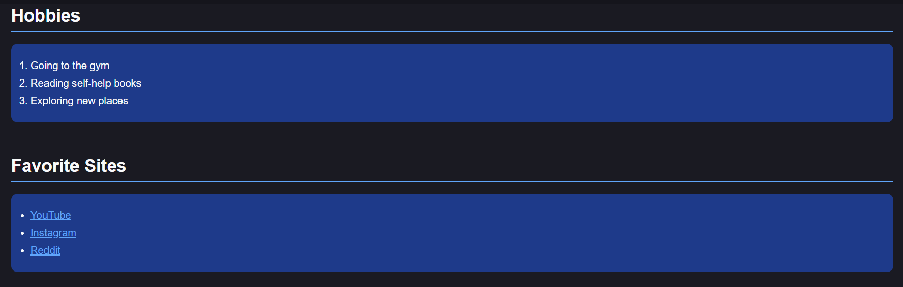
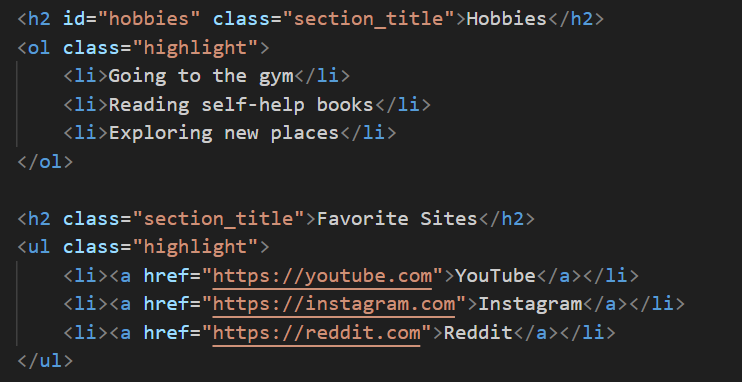
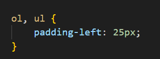
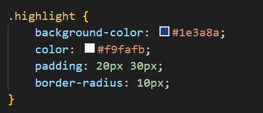

### Step 3: Image and Links

Then, I inserted my photo and added links to YouTube, Instagram, and Reddit to follow assignment instructions.

**Screenshot:**
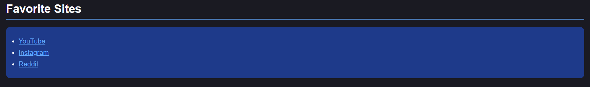
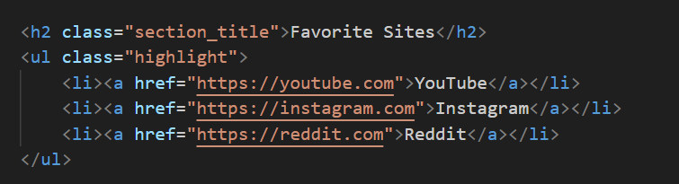
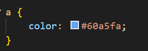

### Step 4: Button

I added button with the text "Click Me to go to my Linkedin".

**Screenshot:**
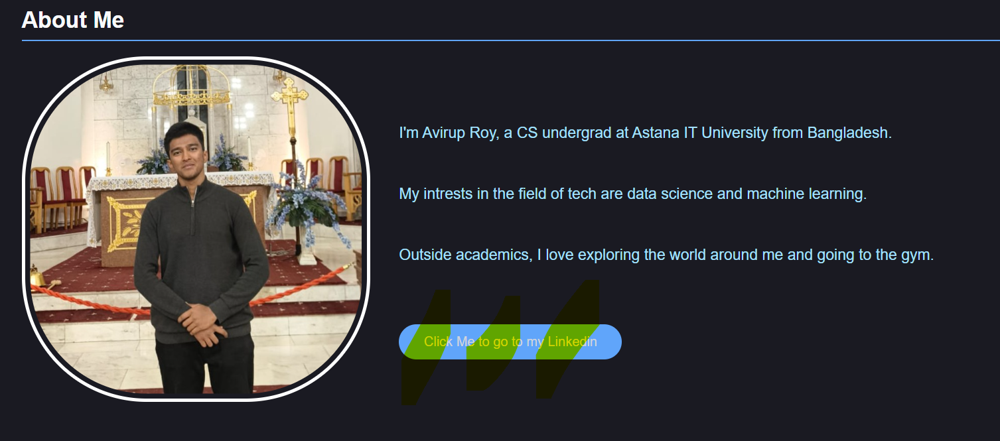
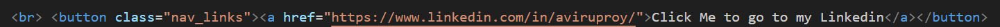
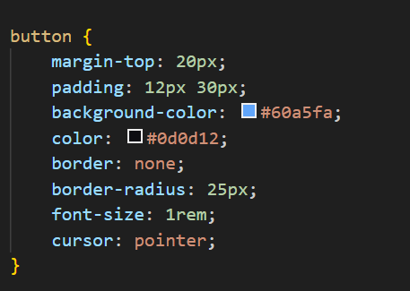

---

## Intermediate HTML:

### Step 5: Table

I created a weekly class schedule with 3 columns: Subject, Day and Time. I used `rowspan` to merge the same subject which take consecutive hours, and I used `colspan` for a title row at the top.

**Screenshot:**
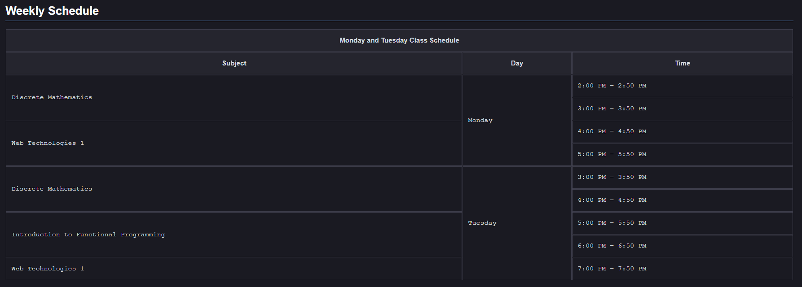
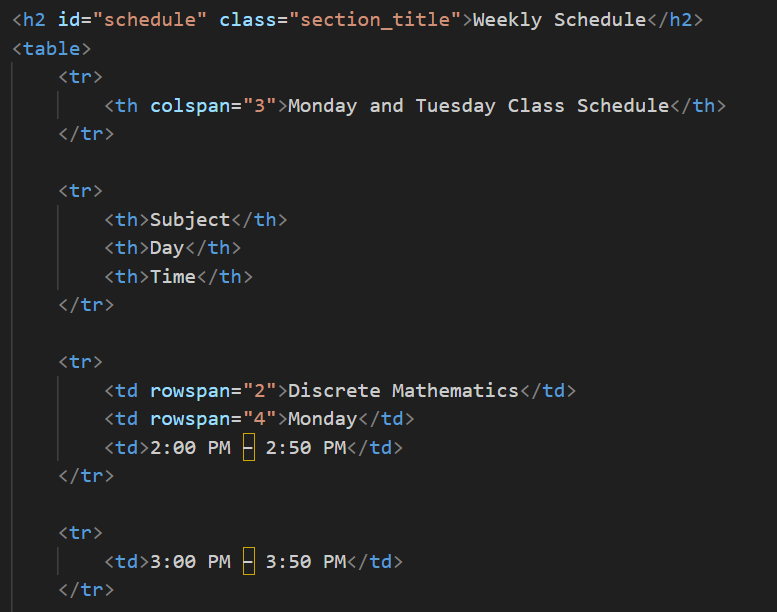
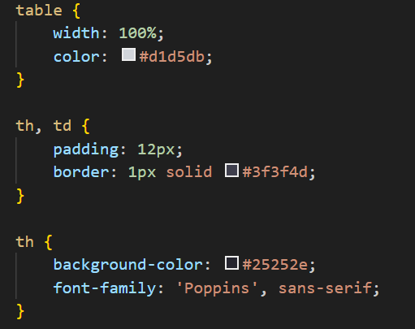

### Step 7: Emojis

Then, I added a "My Mood Today" section with emojis.

**Screenshot:**
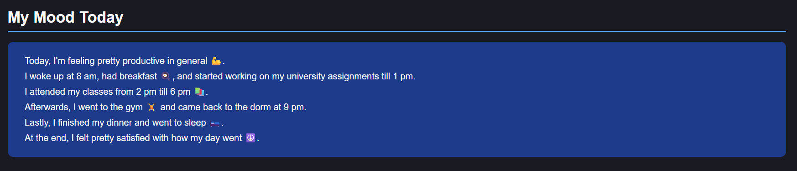
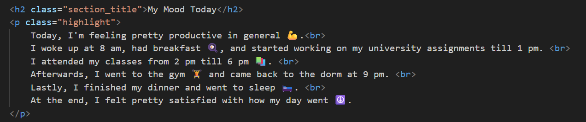
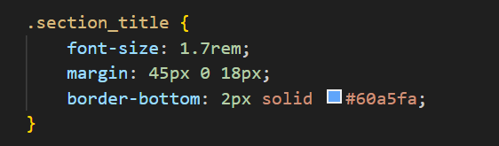

### Step 8: Form

I created a contact form with text inputs for name, email input, color and a submit button.

**Screenshot:**
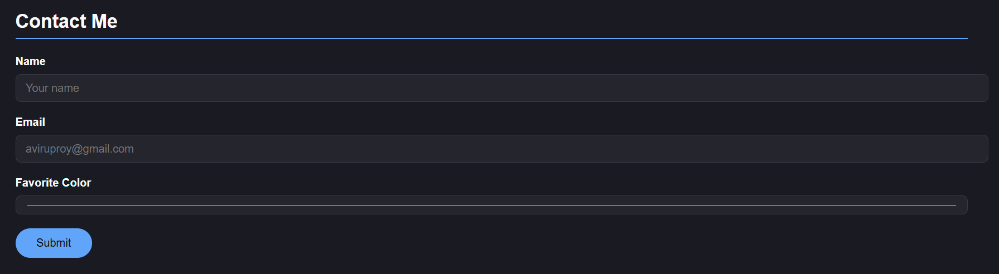
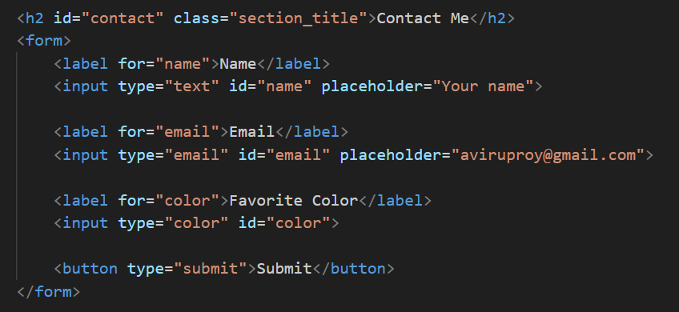
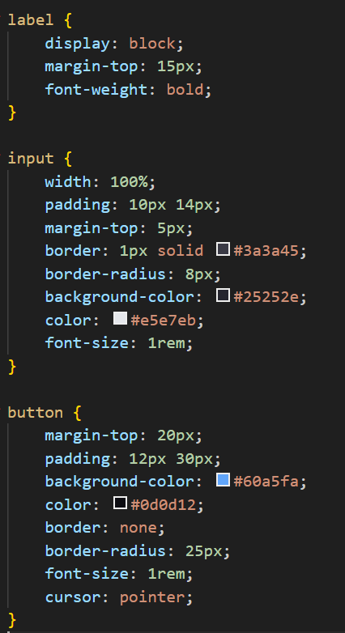
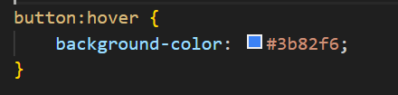
---

## Introduction to CSS:

### Steps 9–11: Inline, Internal, External CSS

- I applied inline CSS on the "About Me" section text (`style="color: #a5e2ff;"`)
- Then, I applied internal CSS in the `<head>` for setting the table font
- Finally, I use external CSS linked via `style_i.css` for all other styling.

**Screenshot:**
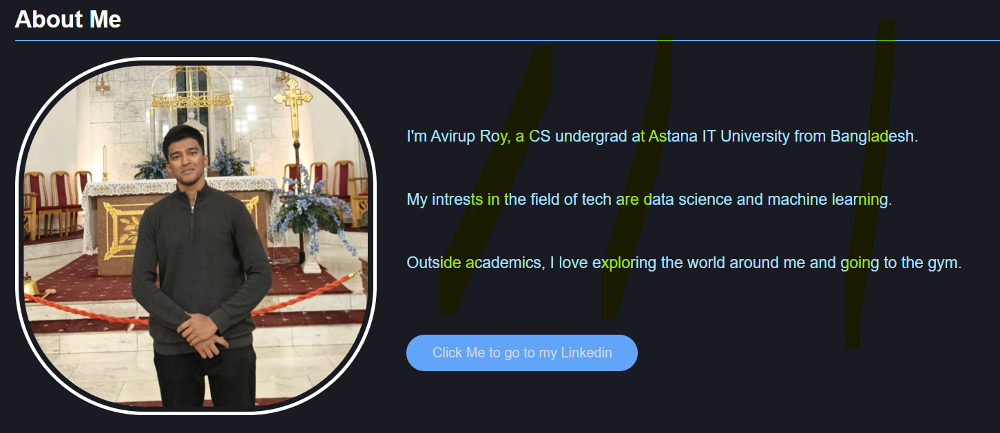
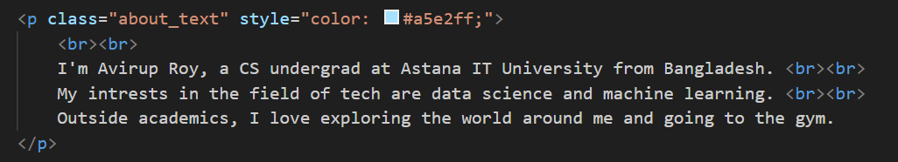

### Steps 13–14: Selectors, Classes vs IDs

- Places I used element selectors: `body`, `label`, `table`, `button`
- Places I used class selectors: `.highlight`, `.section_title`, `.all_box`
- Places I used ID selector: `#main_heading`
- I used `.highlight` on multiple elements (lists and mood section)
- I used ID `#main_heading` on exactly one element

**Screenshot:**

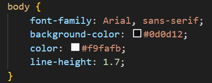
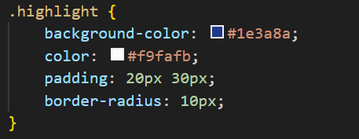
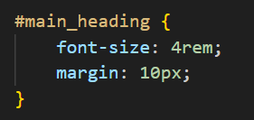

---

## Intermediate CSS

### Step 15: Favicon

I added a favicon using the link tag.

**Screenshot:**

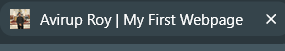
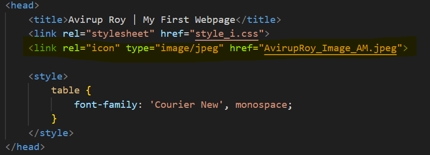

### Step 16: Divs

I used `
` to group sections like nav, header, main, footer, and styled them with background colors and padding.

**Screenshot:**
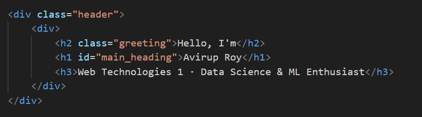

### Step 17: Box Model

I have used borders, padding, and margins in this assignment. The profile picture has all three, table cells have padding and borders, form inputs also have all three.

**Screenshot:**
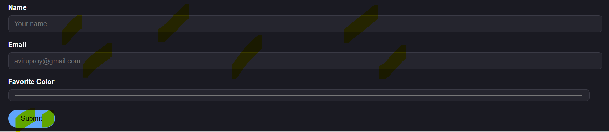
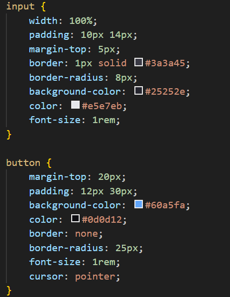

### Positioning

I created a box with three elements: `.static_box` (position: static), `.relative_box` (position: relative with `left: 40px`), and `.absolute_box` (position: absolute pinned to the top-right corner).

**Screenshot:**
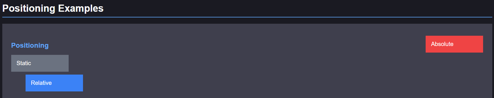
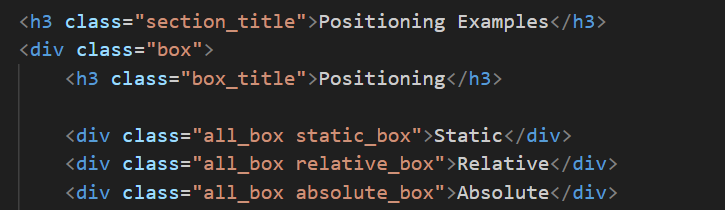
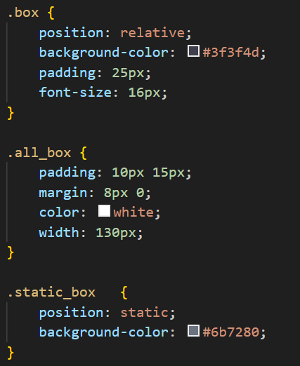
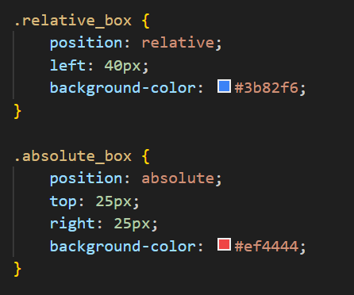

### Step 19: Sizing Units

I used all the sizing units:
- `px` — borders, padding, margin
- `%` — table width, float box widths
- `em` — `.box_title` font-size
- `rem` — headings, greeting, buttons

**Screenshot:**

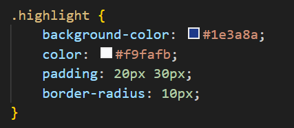
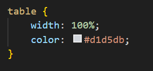
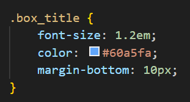
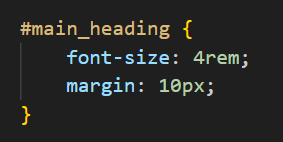

### Step 20: Float and Clear

I used two boxes for float and clear: one floated left, one floated right. Then, I used an empty `.clear_fix` div with `clear: both` after them to prevent the parent from collapsing. The same clearfix is used in the About Me section to contain the floated profile picture.

**Screenshot:**

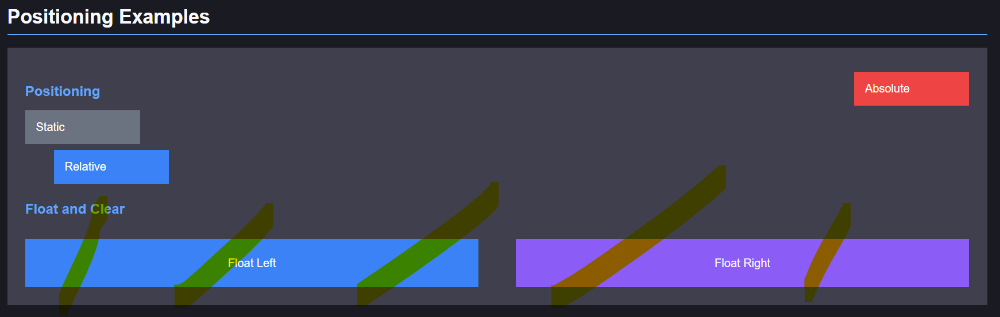
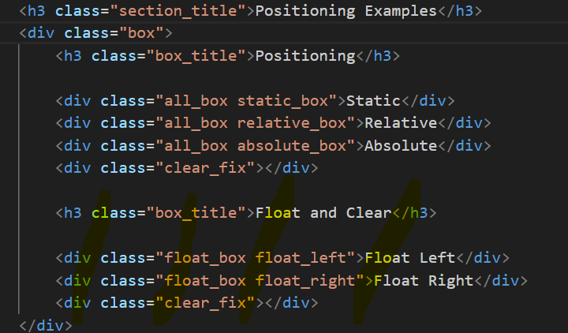
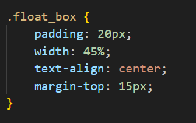
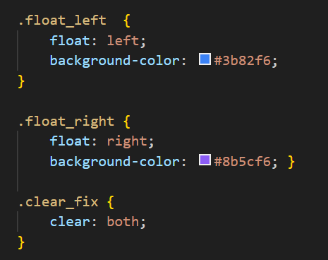

---
